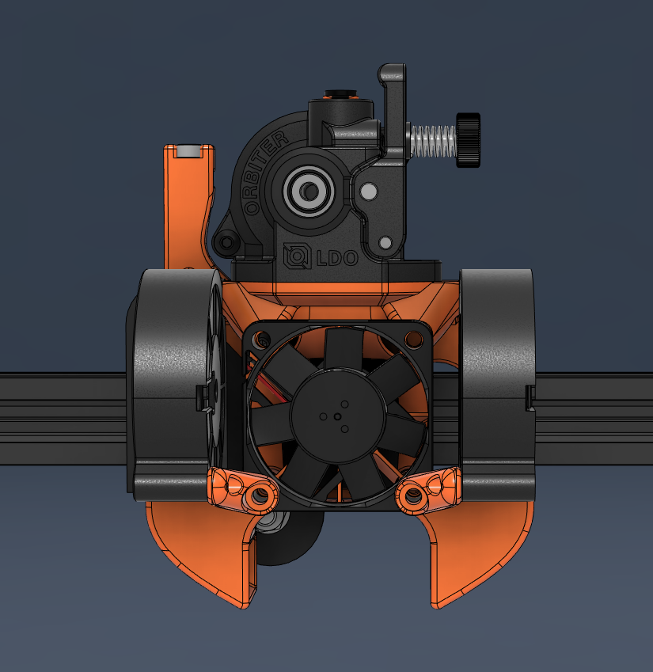

A mod to the Stiffy toolhead by **Churls**, adding support for the LDO Orbiter 2.0 extruder for Ender 3 and Ender 3 V2  
https://github.com/churls5495/Annex-Engineering_User_Mods/tree/main/Extruders/Sherpa_Mini/Toolheads/Churls-Stiffy_E3

 

Note: For BL Touch probes you have to get the NoProbes version and then print a mount that attaches to the front fan like the one below:  
https://github.com/churls5495/Annex-Engineering_User_Mods/blob/main/Extruders/Sherpa_Mini/Toolheads/Churls-Stiffy_E3/STLs/Optional/BLTouch_4010_brace.STL
