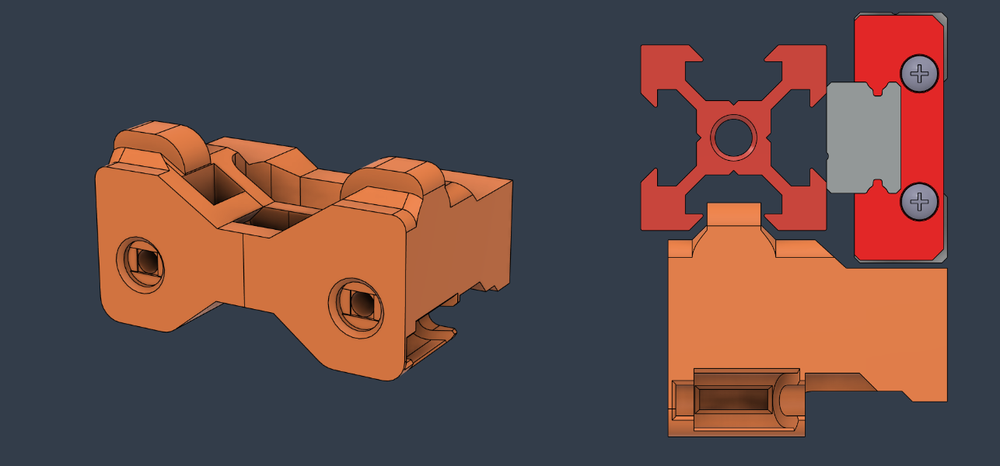

# Ender 3 Belt Attachment for LH Stinger Toolheads 

 

This mod adapts the [LH Stinger](https://github.com/lhndo/LH-Stinger) Toolheads for the Ender 3 printers with a MGN12H linear rail on the X axis. 

 

    

    

  
 
   

 

## Aligned Belt Path Version

* The aligned belt path version is designed to keep keeping both sides of the belt colinear.
* This requires precise alignment of the belt path and may require some tweaking to get it right.

  

## Notes

 

For support please join us on the [LH Stinger Discord](https://discord.gg/EzssCfnEDS)

 

## Print Settings

**Filament**: ASA  
**Nozzle Size**: 0.4 or 0.5 mm 
**Layer Height**: 0.2  
**Perimeters**: 5  
**Bottom/Top Layer**: 5/6  
**Line Width**: 0.4/0.5 (larger for sparse infill)  
**Infill Density**: 40% minimum  
**Infill Type**: Gyroid, Cubic
