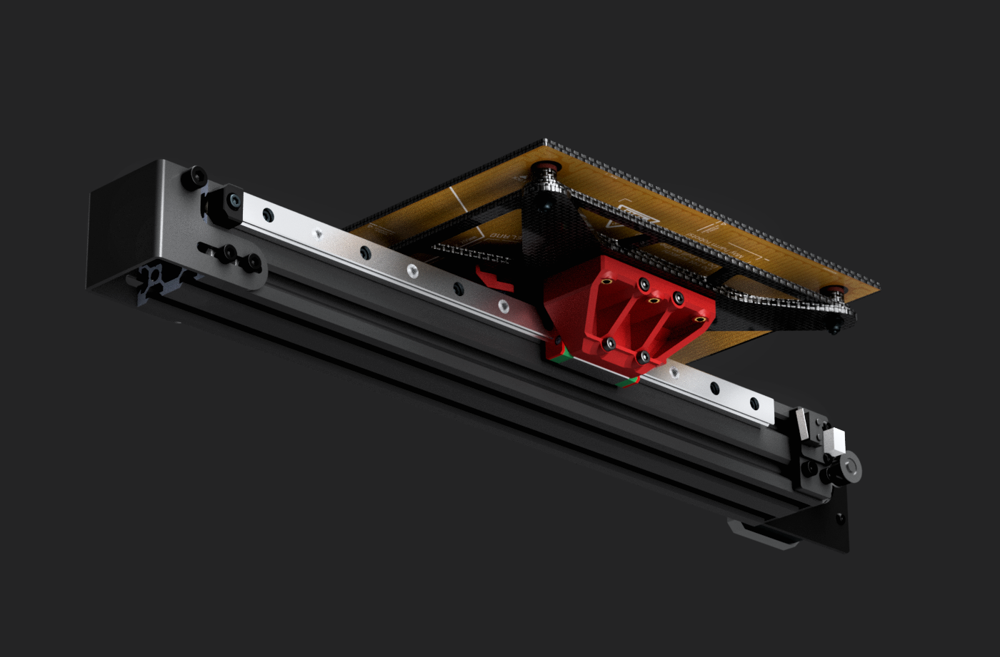
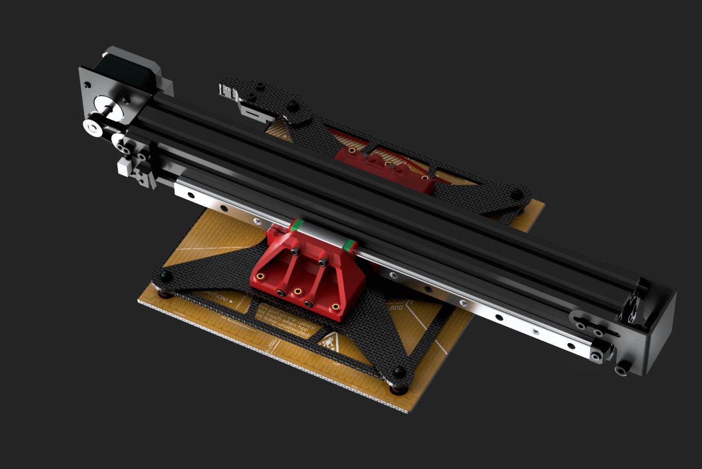
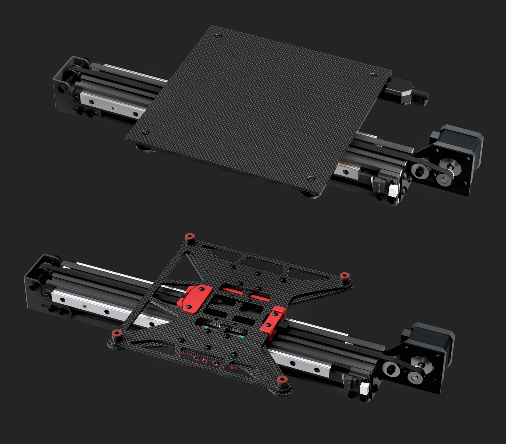
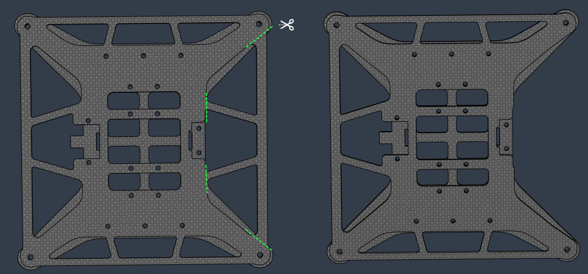
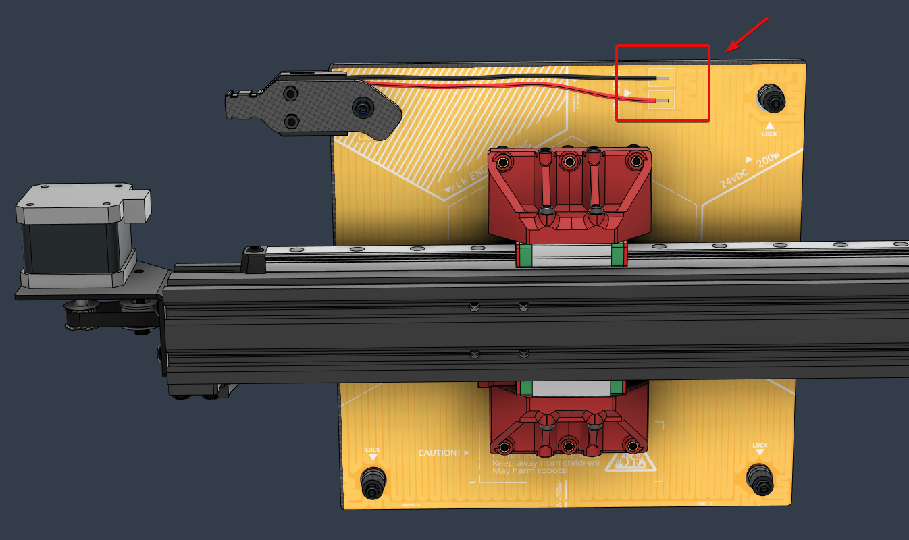

# Ender 3 / LH Stinger CF Carriage and Bed 

**Beta** - *Untested*

 

This mod adapts the LH Stinger CF Carriage and Bed to the Ender 3 builds with a 4040 Y extrusion (Ender 3 Pro, V2 and the Neo variations) and two 300mm MGN12H linear rails. 

The carriage supports both the 200mm CF bed and the standard Ender 3 bed, sharing the same screw mount pattern.  
The print area might vary on the 235mm bed depending on the toolhead used and the stepper mount and tensioner used. 

    

    

   

## Notes

 

Please consult the CAD for build and installation details.  
For support please join us on the [LH Stinger Discord](https://discord.gg/EzssCfnEDS) 

 

* If you use a default rear stepper motor mount which sits higher than the belt, then you will need to cut the following arms from the top carriagge plate. This change should not make a big impact on the structural support.

    

* If you use the LH Stinger PI bed heater, then the cables have to be soldered and oriented in the following position to avoid any possibility of them rubbing with the real stepper motor 

    

* The silicon bed spacers are cut from a standard red 16mm silicon bed spacer.    
The cutting jig can be found here: https://github.com/lhndo/LH-Stinger/blob/main/STL/Other/Silicone%20Bed%20Spacer%20Cutting%20Jig.stl

## BOM

- LH Stinger CF Bed and Carriage kit
- LH Stinger Polyimide Bed Heater - 200W
- 2x 300mm MGN12H Linear Rails (Z1 preload preferred)
- Red 16mm silicone bed spacer
- Fasteners

 

## Print Settings

**Filament**: ASA  
**Nozzle Size**: 0.4 or 0.5 mm 
**Layer Height**: 0.2  
**Perimeters**: 5  
**Bottom/Top Layer**: 5/6  
**Line Width**: 0.4/0.5 (larger for sparse infill)  
**Infill Density**: 40% minimum  
**Infill Type**: Gyroid, Cubic