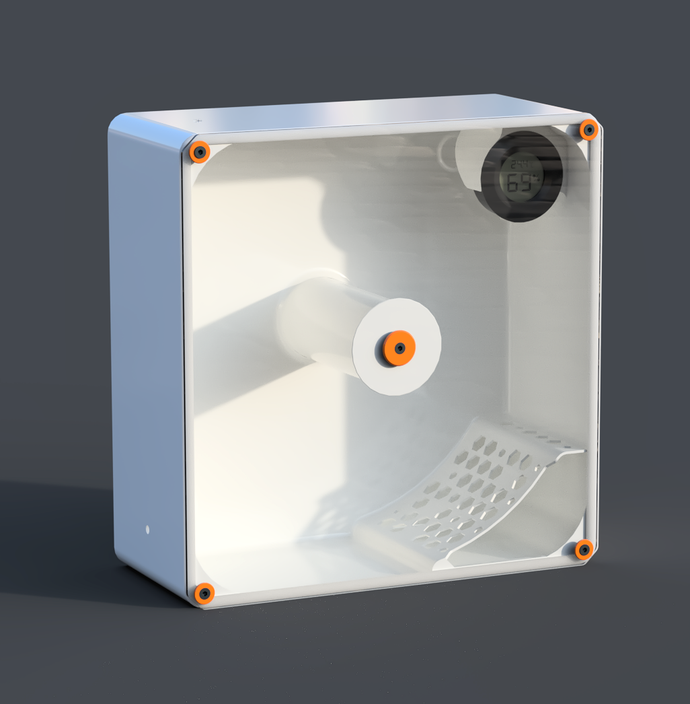
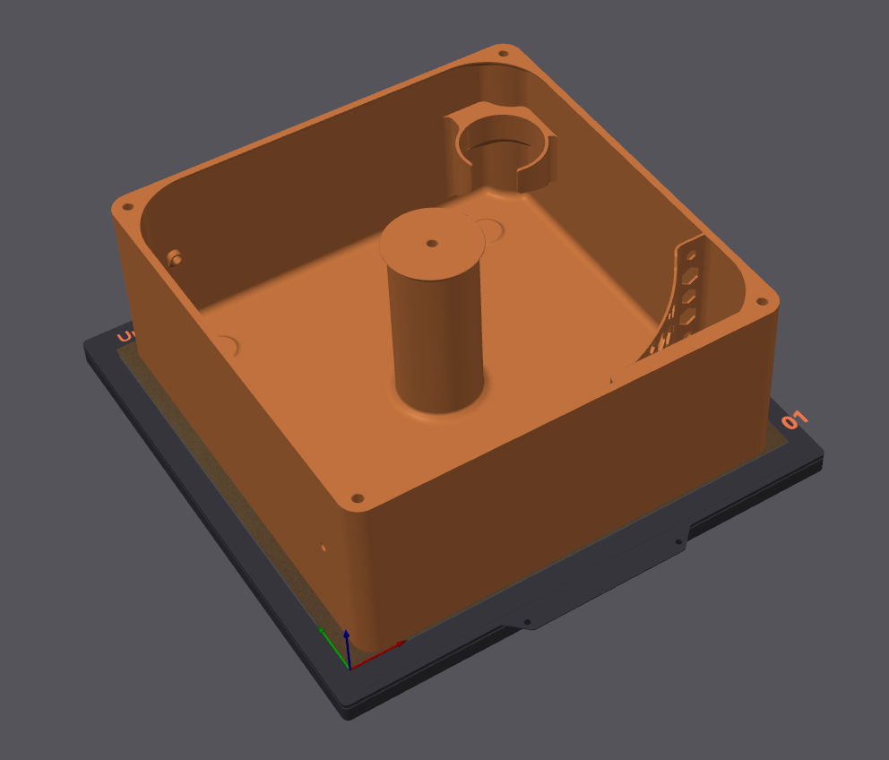
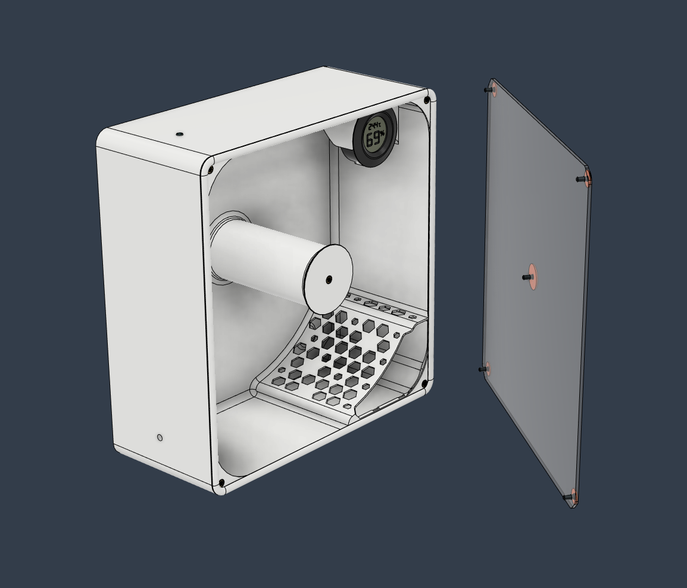
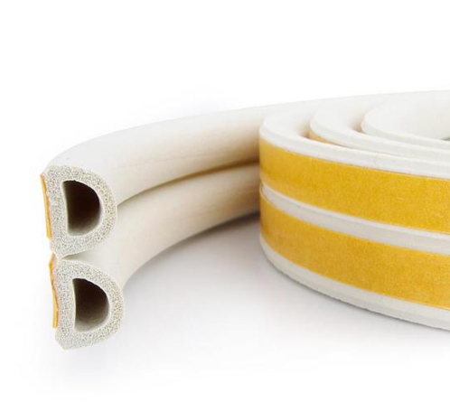
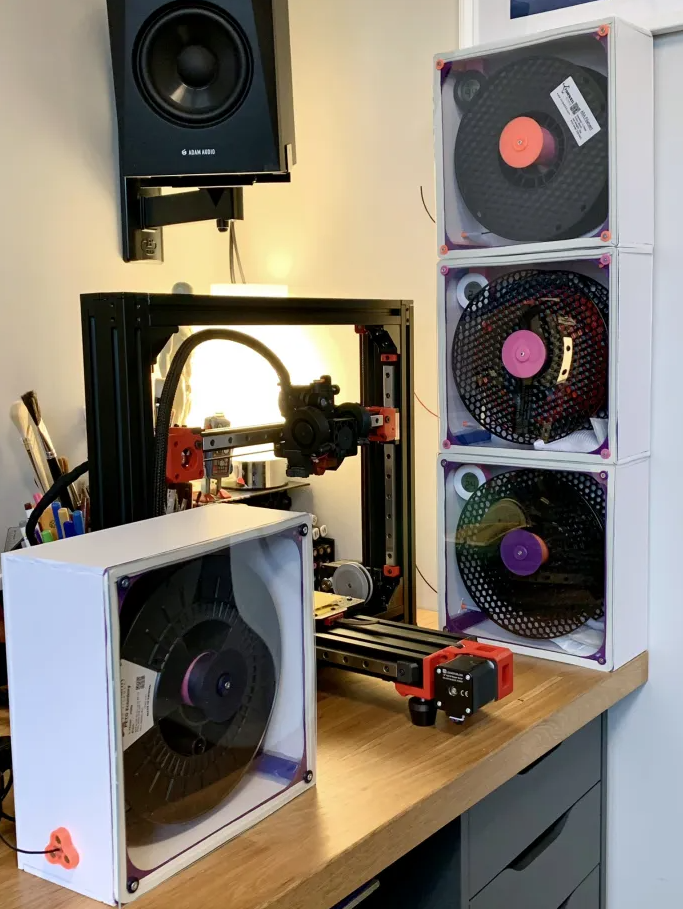

# Filament Dry Box

Easy single print filament dry box module.  
Print weight - 260g

 

 

 

 

 |  
--- | ---
   

# BOM 

* 2mm Clear Acrylic Sheet 223x218mm
* 5x4 Heat Inserts x 5
* M3 8mm Countersunk Screws x 5
* D-Shape Weather Stripping Rubber Seal

 
&nbsp;&nbsp;&nbsp;&nbsp;&nbsp;&nbsp;

# Print Settings

**Filament**: PLA  
**Nozzle Size**: 0.4 or 0.5 mm 
**Layer Height**: 0.25  
**Perimeters**: 2  
**Bottom/Top Layer**: 3/2  
**Line Width**: 0.46/0.54 
**Infill Density**: 10%   
**Infill Type**: Honeycomb  
**Wall Generator**: Classic

 

## Support

Please join us on the [LH Stinger Discord](https://discord.gg/EzssCfnEDS)

 

*Original DIY version:*

