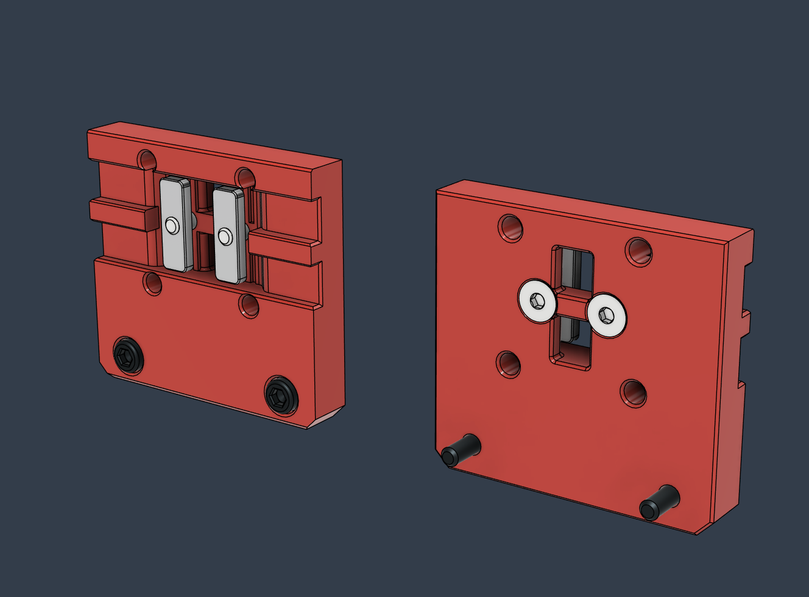

# LH Stinger Toolheads to Voron 2.4 Adapter Plate

**Alpha** - *Untested*

 

This is an adapter plate based on the Voron V0 belt mount.

 

    

    

  
 

 

## Notes

Might require some custom cut Button Head screws that attach the toolhead though the adapter onto the MGN12H cart. 
